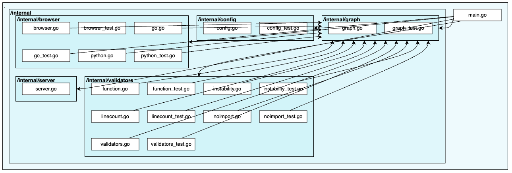

# BigPicture: Validate Architecture
**Do not tell the rules, define them.**

BigPicture is a tool to validate the architecture of project. 
It can be used in Continuous Integration (CI) pipelines to validate the architecture of the project
like in the `.github/workflows/codequality.yml`.

# Why do we need this tool?
There are many rules to define the architecture of a project and it is hard to keep them in mind.
For instance, 
- In a layered architecture, a package can not import a package from the upper layer.
- In a hexagonal architecture, a package can not import a package from the outer layer.
- A package can not have a file which has more than 100 lines.
- A package can not have a function which has more than 20 lines.

BigPicture allows you to define these rules in a `.bigpicture.json` file and validate the architecture of the project.


# Supported Languages
- Go
- Python
- Java
- C# (Under Development)
- JS (Under Development)
--------------------
- [Installation](#installation)
    - [Install with Go](#install-with-go)
    - [Install on Linux](#install-on-linux)
    - [Install on Macos](#install-on-macos)
- [Usage](#usage)
    - [Server](#server)
    - [Validate](#validate)
    - [.bigpicture.json File](#bigpicturejson-file)
- [Validators](#validators)
    - [NoImportValidator](#noimportvalidator)
    - [LineCountValidator](#linecountvalidator)
    - [FunctionValidator](#functionvalidator)
    - [InstabilityValidator](#instabilityvalidator)
- [Contribution](#contribution)

# Installation
## Install with Go
```bash
go install github.com/ismailbayram/bigpicture@1.1.2
```
## Install on Linux
```bash
curl -L https://github.com/ismailbayram/bigpicture/releases/download/1.1.2/bigpicture-amd64-linux -o /usr/local/bin/bigpicture
chmod +x /usr/local/bin/bigpicture
```
## Install on Macos
```bash
curl -L https://github.com/ismailbayram/bigpicture/releases/download/1.1.2/bigpicture-amd64-darwin -o /usr/local/bin/bigpicture
chmod +x /usr/local/bin/bigpicture
```

# Usage
## Server
Runs a server on port 44525. Architecture of the project can be seen on the browser.
```bash
bigpicture server
```


## Validate
Validates the architecture of the project according to the rules defined in the `.bigpicture.json` file.
```bash
bigpicture validate
```

## .bigpicture.json File
`.bigpicture.json` file is used to define the rules. It should be in the root directory of the project.
```json
{
    "lang": "go",
    "port": 44525,
    "ignore": [
        "web"
    ],
    "validators": [
        ...
    ]
}
```
**root_dir**: Let's say that you have java project and its structure is like this:
```
src
├── main
├──├── java
```
But imports are like this:
```
import com.example.project
```
In this case, you should define the root directory of the project as `/src/main/java/` 
in order to bigpicture build import maps correctly. Do not forget `/` both at the beginning and the end of the path.

*Note: Supported for Java and Python.*

**lang**: BigPicture sometimes fails on detecting language of the project. You can define the language of the project.

**port**: Port number of the server. Default value is 44525.

**ignore**: Directories to ignore. Default value is empty. For instance in this project `web` directory includes
non-go files, thus it should be ignored.

**validators**: List of validators. Default value is empty. See [Validators](#validators) section for more information.

## Validators
### NoImportValidator
Checks if the package imports the given package. **It can be used in layered architectures.**

**Example 1**:
For instance, in this project, `/internal/config` package can not import any other package. 
```json
{
    "type": "no_import",
    "args": {
        "from": "/internal/config",
        "to": "*"
    }
}
```
**Example 2**:
For instance, in this project, `/internal/validator` package can not import any package in the `/internal/browser` package. 
```json
{
    "type": "no_import",
    "args": {
        "from": "/internal/validator",
        "to": "/internal/browser"
    }
}
```

### LineCountValidator
Checks if the package has files which have more than the given number of lines.

**Example**:
For instance, in this project, `/internal/browser` package can not have files which have more than 100 lines. 
```json
{
    "type": "line_count",
    "args": {
        "module": "/internal/browser",
        "max": 100,
        "ignore": ["*_test.go", "test/*.go"]
    }
}
```

### FunctionValidator
Checks if the package has functions which have more than the given number of lines.

**Example**:
For instance, in this project, `/internal/browser` package can not have functions which have more than 10 lines. 
```json
{
    "type": "function",
    "args": {
        "module": "/internal",
        "max_line_count": 50,
        "ignore": ["*_test.go", "test/*.go"]
    }
}
```

### InstabilityValidator
Checks if the instability metric of a package according to its directory is more than the given number.

**Instability Calculation**:

Package A is imported by 3 packages and it imports 2 packages. Instability metric of the package A is
`2 / (2 + 3) = 0.4`.

**Example**:
For instance, in this project, `/internal/graph` package can not have instability metric more than 0.5. 
```json
{
    "type": "instability",
    "args": {
        "module": "/internal/graph",
        "max": 0.5
    }
}
```


# Contribution
There are many ways in which you can participate in this project, for example:

- Implement a new validator in `/internal/validator` directory.
- Implement a new language support in `/internal/browser` directory.
